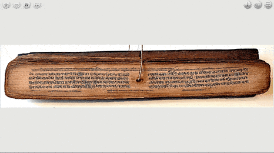

# Quick palaeographer

This tool is based on OpenSeadragon and Annotorious, and is intended to be used to images of manuscripts. Use SHIFT-click to draw bounding boxes, and tag glyphs. Then, open the annotation sidebar to see all your annotations. They are listed in Sanskrit alphabetical order.

This tool was created as part of the [TEST project](https://tst.hypotheses.org/), funded by the research program FRAL 2018 (ANR & DFG). The manuscript image in the demonstration is courtesy of the Bibliothèque nationale de France.

## Usage

Quick palaeographer can be used either online, via [https://chchch.github.io/quick-palaeographer/](https://chchch.github.io/quick-palaeographer/), or offline, by downloading the whole repository and opening the `index.html` file in a web browser. Tested on current versions of Chrome and Firefox.

1. Select an image file to load (PNG or JPEG)
2. Use SHIFT-click to draw boxes around a character.
3. Give the character some labels. It can have more than one label.
4. Click OK.
5. Open the annotations sidebar (button in the top-right corner) to see your annotations.
6. You can save your annotations in JSON format with the Export button.
7. You can load your annotations again later (they are also autosaved).
